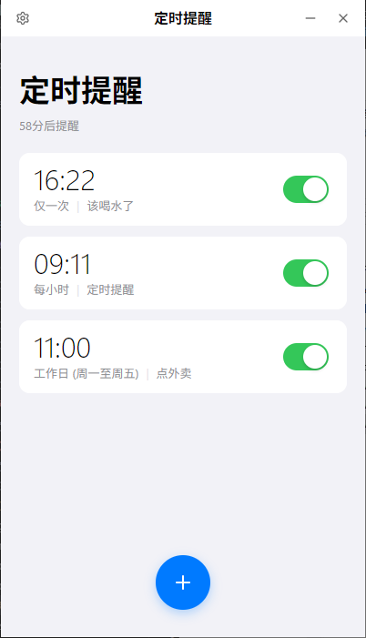
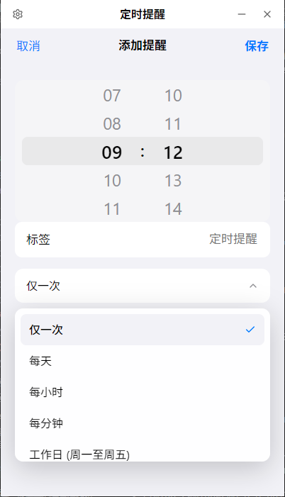
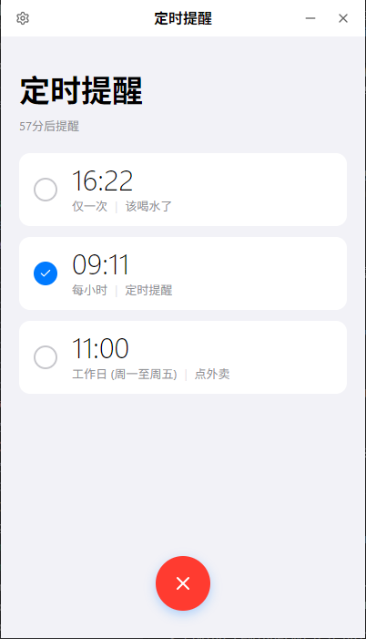
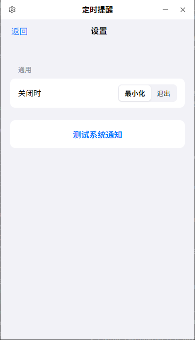
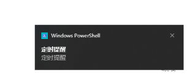

# 定时提醒 (Timing Reminder)

一个简单易用的 Windows 定时提醒工具，帮助你按时喝水或休息。支持多种灵活的重复规则，如工作日、轮班、自定义间隔等。

## ✨ 功能特点

- **多样的提醒规则**：
  - 📅 **基础**：仅一次、每天
  - 💼 **办公**：工作日 (周一至周五)、大小周 (周一至周六)
  - ⏱️ **循环**：每小时、每分钟、自定义间隔 (例如每 45 分钟)
  - 🔄 **轮班**：支持自定义“做 N 休 M”的轮班制
- **系统级通知**：使用 Windows 原生通知，支持系统专注模式。
- **极简设计**：清爽的界面，不占用过多资源。

## 截图






## 📦 下载与安装

无需安装任何编程环境，只需下载安装包即可使用。

### 1. 获取安装包
请前往项目的 **Releases** 页面（如果项目托管在 GitHub/Gitee）下载最新版本，或者直接联系开发者获取安装包。

**文件名示例**：
- `water-reminder_0.1.0_x64-setup.exe`

### 2. 安装步骤
1. **双击运行**：下载后双击 `.exe` 安装包。


---

## 🛠️ 开发者指南 (For Developers)

如果你想自己修改源码或重新打包：

### 环境要求
- [Node.js](https://nodejs.org/) (建议 v18+)
- [Rust](https://www.rust-lang.org/) (最新稳定版)
- [VS Code](https://code.visualstudio.com/) + Tauri 插件

### 常用命令

```bash
# 安装依赖
npm install

# 本地开发运行
npm run tauri dev

# 打包构建 (生成 .msi 或 .exe)
npm run tauri build
```

> **构建产物位置**：
> 打包成功后，安装包位于 `src-tauri/target/release` 下。
